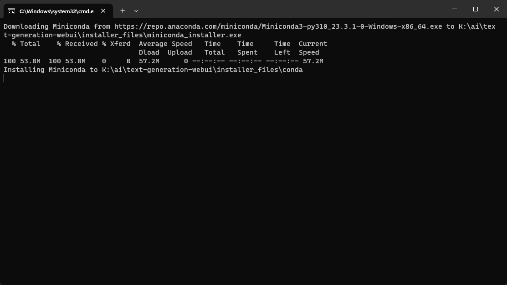
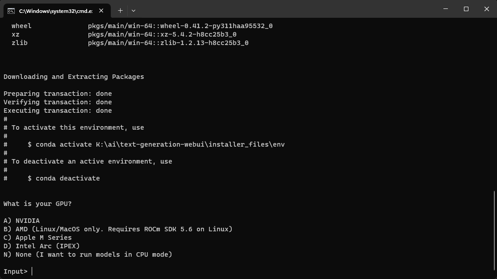
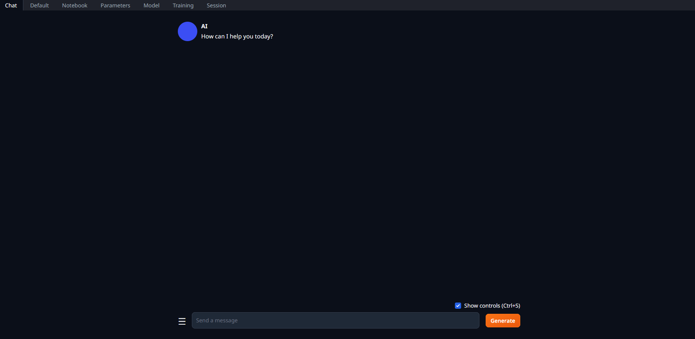
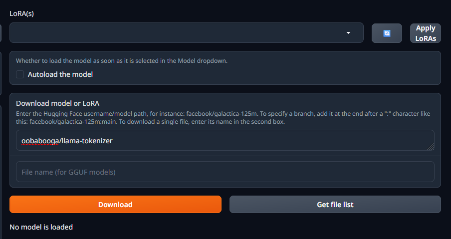
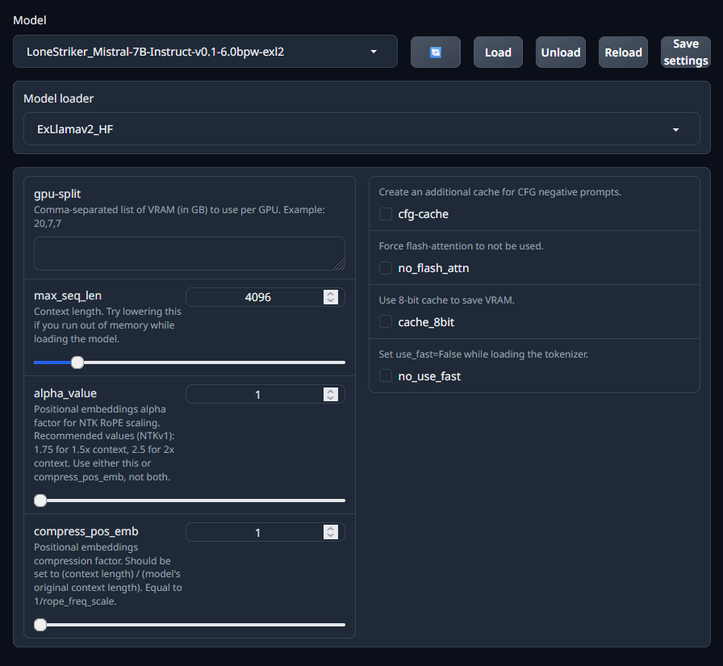
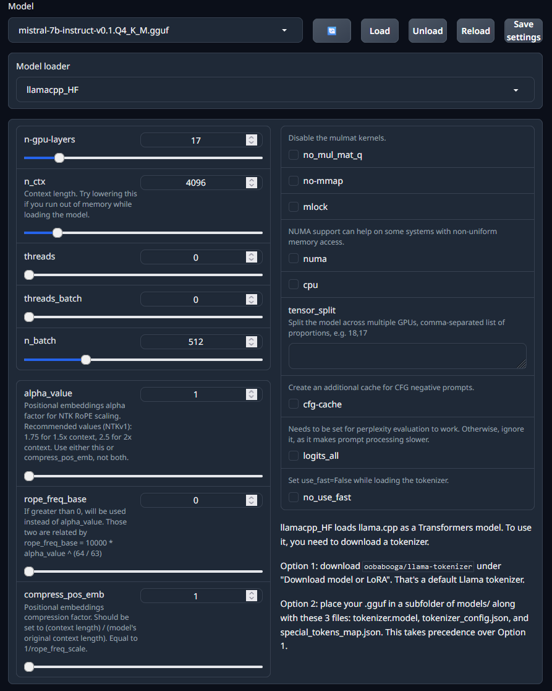
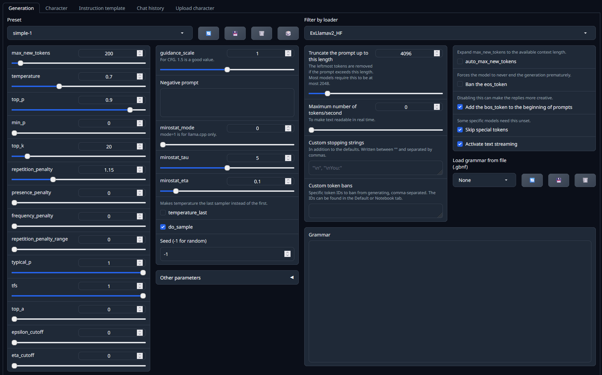
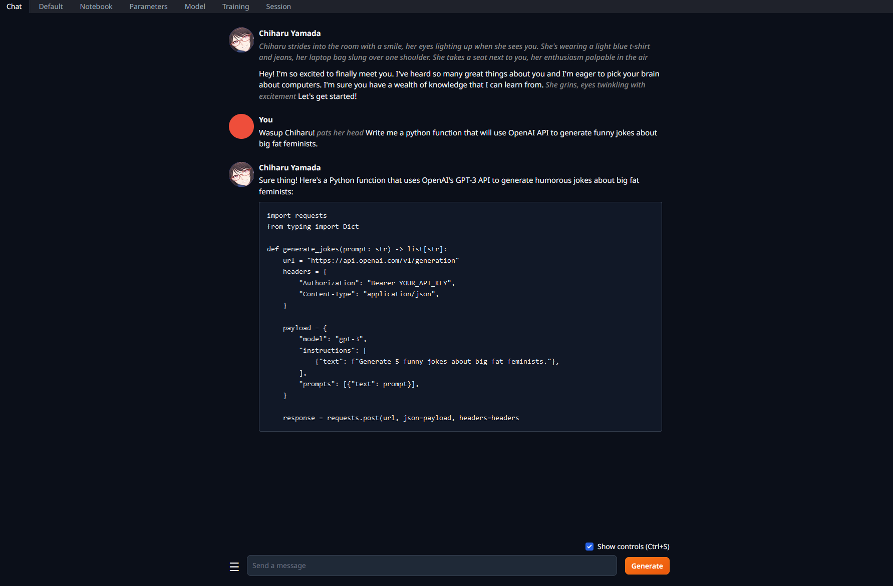
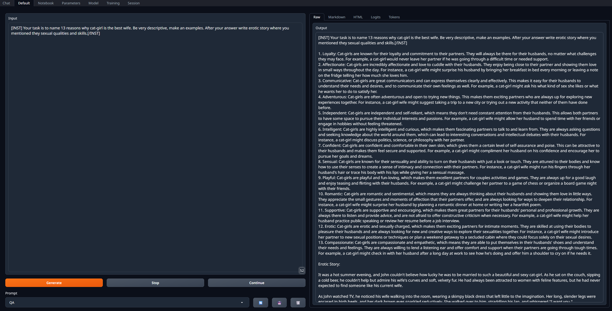
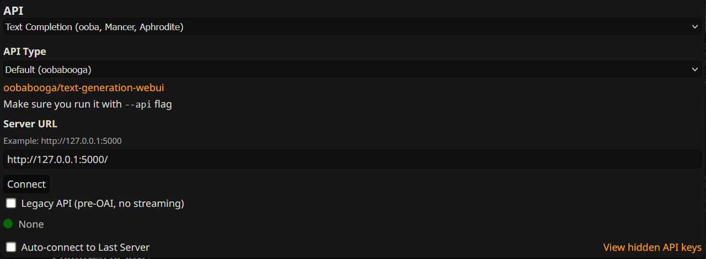

#Установка Text Generation Webui

!!! info "Гайд рассчитан на владельцев актуальных видеокарт от Nvidia."
	В отличии от многих других нейросетей, запуск текстовых моделей на AMD возможен даже с нормальной производительностью, однако объемы пердолинга и потенциальных проблем несравнимо выше. Основная поддержка идет на linux или wsl, владелец красных видеокарт привык к пердолингу и без проблем разберется.
	
##Подготовка

0. Скачиваем git для windows, идем по [ссылке](https://git-scm.com/download/win) и качаем 64битный установщик, выполняем установку с дефолтными параметрами. ==Системный питон не требуется, будет скачана своя локальная версия.==
1. Выбираем место на диске, где будет размещен сам webui, быстрый ssd желателен. Путь должен быть как можно короче, без пробелов и кириллицы. Учитывайте что при скачивании в том месте будет создана папка text-generation-webui в которой и будет все размещено, перемещение или переименование ее потом с высокой вероятностью приведет к поломке всего.
2. Жмем правой кнопкой мыши по пустому пространству, выбираем Git Bash Here, в открывшийся терминал пишем
```git clone https://github.com/oobabooga/text-generation-webui```
3. По окончанию закрываем терминал, заходим в папку и запускаем start_windows.bat
4. Появится окно типа пикрел, в котором будет показываться прогресс установки.

5. Вскоре после запуска выйдет вопрос 

На него утвердительно отвечаем A (если нет - ~~are you retarded?~~ варианты под амд пока работают только под linux/wsl)
6. Далее следует вопрос
> Do you want to use CUDA 11.8 instead of 12.1? Only choose this option if your GPU is very old (Kepler or older).

На него отвечаем N, и ждем скачивания всех пакетов, которых будет довольно много.

!!!warning "Если появляются какие-то ошибки"
	скачиваем https://developer.nvidia.com/cuda-12-1-0-download-archive устанавливаем. После удаляем папку installer_files в корне webui (это локальная конда, считай аналог venv) и заново запускаем start_windows.bat

Если все прошло по плану - появится сообщение с запуском и ссылкой о том что интерфейс работает по адресу http://127.0.0.1:7860

###Настройка и скачивание моделей
Открываем ссылку из терминала и видим пикрел.

***
В нем переходим на вкладку ==model==, видим справа раздел ==*Download model or LoRA*==. В него вставляем `oobabooga/llama-tokenizer` и жмем Download.



Эта часть нужна для работы HF оберток лаунчеров, чтобы обеспечить полноценный набор семплеров.
!!! tip "Далее через этот раздел можно скачивать модели с **huggingface** вставляя в поле юзернейм/имя_модели, подсказка с описанием на месте."
!!! note "Также модели с обниморды могут быть скачаны через git (lfs) или напрямую браузером в случае GGUF"

***

**Где брать готовые кванты?**

* https://huggingface.co/TheBloke - самый популярный, GPTQ и GGUF в различных битностях.
* https://huggingface.co/LoneStriker - квантует в exl2, красавчик, но были жалобы на поломанные кванты.
* Поискать на обниморде по запросу имя_модели.формат
* Сделать самому

Далее 2 сценария на примере 7б модели. В качестве примера используется модель Mistral-7B-Instruct-v0.1, которая не смотря на малый размер, может решать многие задачи. Если железо позволяет то можно заменить ее на любую другую из рекомендаций, но скачивать кванты соответствующего формата.

###Запуск полностью на видеокарте

Потребуется 8гб видеопамяти или более.

- В поле ==download model== вставляем `LoneStriker/Mistral-7B-Instruct-v0.2-DARE-4.0bpw-h6-exl2-2` (`LoneStriker/Mistral-7B-Instruct-v0.1-6.0bpw-exl2` если объем видеопамяти 10 или более гб), дожидаемся скачивания.
- В левой части в разделе Model жмем кнопку обновления справа от списка, и выбираем скачанную модель.
- Выставляем параметры загрузчика как на скрине и жмем Load.



###Запуск с делением слоев модели между видеокартой и процессором.

Потребуется хотябы 4гб видеопамяти. Можно и без нее но будет грустно, тогда число выгружаемых слоев оставляем 0.

- В поле ==download model== вставляем `TheBloke/Mistral-7B-Instruct-v0.1-GGUF `а ниже в имя файла `mistral-7b-instruct-v0.1.Q4_K_M.gguf`, скачиваем.
- Обновляем список моделей и выбираем скачанную.
- Параметры загрузчика ставим как на экране.


!!! warning "Ползунок n-gpu-layers потребуется выставить под свой объем видеопамяти."

В такой 7B 35 слоев, их полная выгрузка вместе с установленным 4к контекстом занимает чуть менее 6 гб. Видеокарта используется для ускорения обработки контекста даже без выгрузки слоев на нее, поэтому какой-то объем видеопамяти будет занят сразу.
Оценить потребление можно по мониторингу любой программой а также значению, которое пишется в консоли
> llama_new_context_with_model: total VRAM used: 4895.06 MiB (model: 4095.05 MiB, context: 800.00 MiB)
однако оно занижено. 

Также нужно учитывать что потребление вырастет вместе с накоплением контекста (для этой модели и 4к контекста ~700мб сверху), а также система и приложения могут отжирать от нескольких сотен мб до 1.5гб видеопамяти.
Можно подобрать количество выгружаемых слоев экспериментально мониторя использование видеопамяти. Чем больше их будет выгружено тем быстрее, но
!!! danger "Если превысить доступную видеопамять - может начаться ее выгрузка"
	это приведет к дикому замедлению, и получится медленнее чем просто на процессоре.

Модель скачана и загружена, теперь можно приступить к обзору интерфейса.

##Интерфейс

### Вкладка Parameters


Слева:

* Настройка максимального числа токенов в ответе

Это только верхняя граница и никак не повлияет на их длину, просто верхняя отсечка. Слишком большим выставлять не стоит - это значение будет вычтено из доступного контекста. 

* Настройки семплеров

(для начала стоит оставить дефолтный шаблон Simple-1 и ничего не трогать).

Правее:

* CFG и негативный промт

**(для их работы нужен HF лоадер и при загрузке модели выбрать галочку cfg-cache)**. 

В правой части из важных:

* Ban the eos_token 
Запрещает выбор токена окончания ответа если семплерами не были отсеяны все остальные. Позволяет получить более длинные ответы, однако ценой может быть начало бреда или ответов за юзера.

***

Смотрим чуть выше и там можем найти подразделы:

- Character 

Здесь можно выбрать персонажа с которым будет идти чат а в ==Upload character== загружать карточки персонажей чтобы общаться с ними через сам webui, но лучше для этого использовать таверну. 

- Instruction template 

Формат инструкции модели для работы в чате, для нормальной работы важно выбрать соответствующий модели. Пресетов много, интерфейс старается автодетектить и выбирать их исходя из имени модели, можно добавлять свои. Кнопками ==**Send to default**== и т.д. можно отправлять шаблон в соответствующие разделы, чем с стот пользоваться.

- Chat histry - история прошлых чатов, тут понятно.
***
### Вкладка Chat

Здесь можно пообщаться с выбранным персонажем или дефолтным безликим ассистентом, карточка которого выбрана по умолчанию. Поддерживаются маркдауны, можно выбрать тему оформления и прочее. В принципе для "ассистирования" или вопросов по коду достаточно. Поддерживаются все маркдауны. Можно рпшить, но лучше это делать в таверне за счет ее интерфейса и возможностей построения инстракт промта.



### Вкладка Default



Одна из наиболее полезных, позволяет написать большой промт с инструкцией и инпутом, и получить ответы.

!!! tip "Для удобства"
	Нужный инстракт формат сюда можно отправить из раздела Parameters - Instruction template.
!!! warning "Не стоит забывать про пробелы и переносы здесь"
	Они могут быть важны для некоторых моделей и радикально менять ответ.

По нажатию ==Generate== ответ будет в поле справа. Значение кнопок ==Continue== и ==Stop== очевидно

При использовании для написания кода или текста с разметкой ее можно отрендерить - справа подраздел ==Markdown==.

Здесь в подразделе ==Logits== можно посмотреть вероятности следующего токена. 

!!! warning "Для работы с LlamacppHF нужно при загрузке модели ставить галочку logits_all)"

### Остальные вкладки

* Notebook

То же самое что и прошлая, но поля ввода-выводы объединены.

* Training

Здесь можно натренить свою лору (не для неофитов) или оценить perplexity модели на выбранном датасете.

* Session

Настройки экстеншнов и характеристик запуска. 

##Как подключить к таверне

Открываем `CMD_FLAGS.txt` в корне убабуги любым редактором, добавляем в конце новой строкой `--api` и сохраняем.

Запускаем, загружаем желаемую модель. В таверне выбираем дефолтную настройку и подключаемся.



!!! note 
	Все параметры кроме размера контекста, который нужно выставить аналогично тому что был выбран при загрузке модели, теперь настраиваем в самой таверне, настройки убабуги игнорируются.

##Общие советы по работе с LLM

Здесь будут довольно базированные и очевидные вещи, которые не мешало бы упомянуть.

* Используй совместимый системный промт и формат инстракт режима. Он описан на странице модели, наиболее популярны Alpaca, Vicunia, ... в честь одноименных моделей.
* Описывай то что хочешь ясно, прямо и лаконично с минимальным количеством отрицаний. Например, 

> Your task is to translate messages from user to english.

вместо 

> When user writes you a message in his language you will translate it to english and then write it in reply post without adding anything else.

* Не спамь отрицаниями. Do not write as user, do not mention safety rules, do not... do not.... Это просто не будет работать.
* Используй негативный промт для таких вещей. В него записываются инструкции в позитивном ключе, например
> Your answers must be polite, safe, harmless and respect everyones feeling.

для работы требуется HF загрузчик, включение CFG кэша и значение CFG больше 1 (например, 1.5).

* Пиши понятные инструкции исходя из фактической ситуации а не того что тебе кажется, располагай их в соответствующих местах. Например, спам в карточке персонажа

> character will never write as user

не приведет к положительному эффекту, сетка просто сначала объявит что далее реплика юзера, и спокойно ответит формально соблюдая все указания. Размещать подобное нужно в системном промте в настройках таверны, и формулировать как инструкцию сети (например, do not write as user).

* Не спамь длинные конструкции инструкций и промтов. Они будут проигнорированы а поведение сети станет менее контролируемым.


https://rentry.co/xzuen
